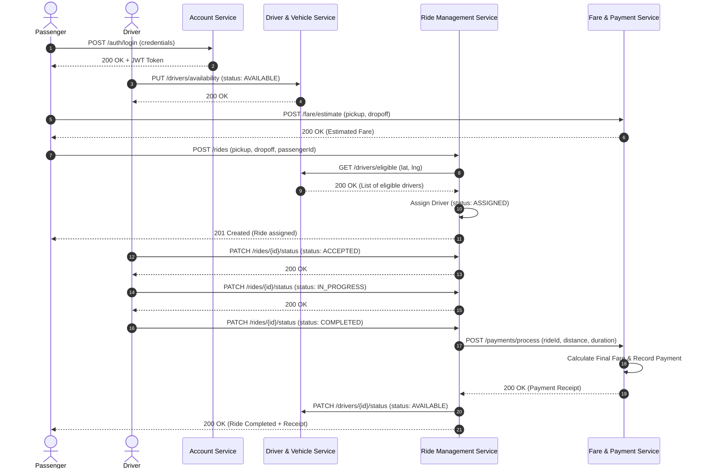

# Interservice Communication Design

**Module:** IT3130 – Application Development  
**Project:** RideLink – Backend Microservices for a Ride-Sharing Platform

---

## 1. Overview & Learning Outcome Justification (LO2)

In compliance with LO2 (*"Compare available inter-application communication methods"*), this document outlines the communication paradigms considered, the architectural reasoning for selecting RESTful HTTP for RideLink, and the detailed contracts for interservice workflows.

---

## 2. Architectural Comparison of Communication Protocols

| Metric / Feature | Synchronous REST (HTTP/JSON) *(Selected)* | gRPC (HTTP/2 + Protocol Buffers) | Asynchronous Messaging (RabbitMQ / Kafka) |
| :--- | :--- | :--- | :--- |
| **Protocol** | HTTP/1.1 or HTTP/2, Text JSON | HTTP/2, Binary Protobuf | AMQP / TCP, Binary / JSON |
| **Interaction Model** | Request / Response (Synchronous) | RPC (Synchronous / Streaming) | Publish / Subscribe (Event-Driven) |
| **Tooling & Debugging** | Extremely high (Postman, Swagger, Curl) | Moderate (Requires grpcurl, proto tooling) | Moderate (Requires queue admin UI) |
| **Suitability for RideLink** | **Ideal for IT3130**: Simple, demonstrable via Swagger UI and Postman without extra infrastructure. | High performance, but introduces complex proto compilation and tooling overhead for viva. | Excellent for massive scale, but adds unnecessary complexity and external brokers for academic scope. |
| **Decision** | **Primary Choice for all Interservice APIs** | Documented as viable high-throughput alternative | Documented as viable event-driven alternative for event broadcasting |

---

## 3. Implemented Interservice Workflows

### Interaction 1: Ride Request -> Eligible Driver Matching & Reservation
- **Caller:** `Ride Management Service` (Port 8083)
- **Target:** `Driver & Vehicle Service` (Port 8082)
- **Endpoint:** `GET /api/v1/drivers/eligible?lat={lat}&lng={lng}&radius={radius}`
- **Purpose:** When a ride is requested, Ride Management queries Driver & Vehicle Service to obtain available drivers within the pickup area.
- **Subsequent Action:** `PATCH /api/v1/drivers/{driverId}/status` updates driver state to `ON_TRIP`.

### Interaction 2: Ride Completion -> Final Fare & Payment Processing
- **Caller:** `Ride Management Service` (Port 8083)
- **Target:** `Fare & Payment Service` (Port 8084)
- **Endpoint:** `POST /api/v1/payments/process`
- **Purpose:** Upon trip completion (`IN_PROGRESS` -> `COMPLETED`), Ride Management transmits final trip telemetry (distance, elapsed time, passengerId, rideId) to compute final fare and simulate payment.
- **Output:** Returns payment confirmation and receipt ID.

---

## 4. End-to-End Workflow Sequence Diagram

