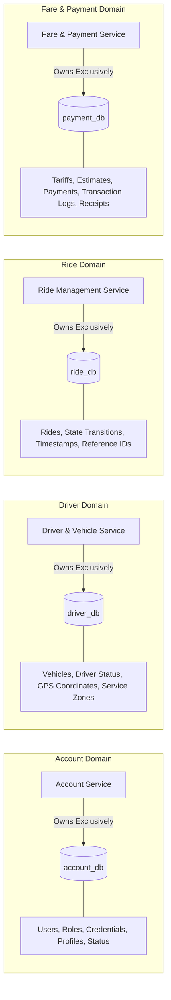

# Data Ownership & Persistence Boundaries

**Module:** IT3130 – Application Development  
**Project:** RideLink – Backend Microservices for a Ride-Sharing Platform

---

## 1. Non-Negotiable Rule: Database per Service

In strict accordance with the IT3130 specification:
> *"Each service must own its persistence boundary. One service must not directly query or modify another service’s database or tables."*

The architecture implements **strict Database-per-Service**. A single shared database across all four microservices is **forbidden**.

---

## 2. Data Ownership Matrix

| Microservice | Dedicated Database | Technology | Exclusively Owned Data Entities / Documents |
| :--- | :--- | :--- | :--- |
| **Account Service** | `account_db` | PostgreSQL (Relational) | • User accounts (passengers, drivers, admins) • Password credentials & salts • User roles & permissions • User profile attributes • Account status (`ACTIVE`, `SUSPENDED`) |
| **Driver & Vehicle Service** | `driver_db` | MongoDB (Document) | • Driver operational records • Vehicle details & specifications • Real-time availability (`AVAILABLE`, `OFFLINE`) • Service area boundaries • Simulated GPS coordinates (GeoJSON / lat-lng) |
| **Ride Management Service**| `ride_db` | PostgreSQL (Relational) | • Ride requests • Pickup and drop-off coordinates/names • Ride lifecycle states & transition logs • External reference IDs (`passengerId`, `driverId`, `fareId`) • Trip start/end timestamps |
| **Fare & Payment Service** | `payment_db` | PostgreSQL (Relational) | • Fare calculation rules & tariffs • Upfront fare estimates • Payment transaction records • Payment status (`PENDING`, `COMPLETED`, `FAILED`) • Immutable receipts & tax/fare breakdowns |

---

## 3. Data Ownership Diagram

---

## 4. Cross-Service Reference Rules

1. **No Shared JPA Entities or Repositories:**  
   Entities from one service's package (e.g. `com.ridelink.account.entity`) can never be imported into another service.
2. **Scalar External Identifiers:**  
   Cross-service relationships are maintained using stable scalar values (e.g., `UUID` or `String` identifiers such as `passengerId`, `driverId`, `fareId`).
3. **No Cross-Database Joins:**  
   SQL `JOIN` queries across databases or schemas are impossible and forbidden.
4. **Data Synchronization via APIs:**  
   When Ride Management needs to check if a driver is available, it makes an HTTP GET request to `Driver & Vehicle Service`'s API. It never reads `driver_db`.
