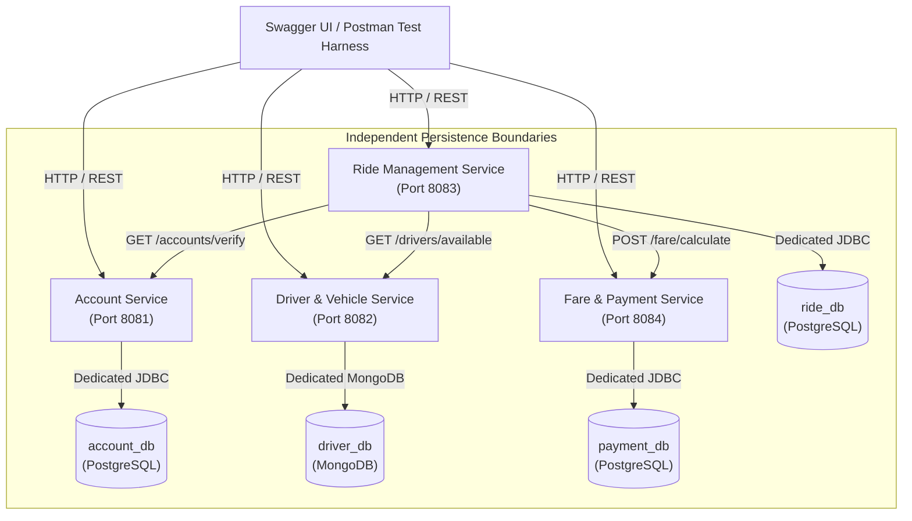

# System Context & Architecture Overview

**Module:** IT3130 – Application Development  
**Project:** RideLink – Backend Microservices for a Ride-Sharing Platform

---

## 1. System Context

RideLink is a fictional ride-sharing platform providing urban mobility coordination between passengers and drivers. In compliance with the IT3130 assignment brief:
- The system is architected exclusively as a **backend microservices solution**.
- A frontend (web or mobile application) is **not required** and is out of scope.
- Demonstration, functional testing, and evaluation are conducted via **Swagger UI / OpenAPI** and a shared **Postman collection**.

---

## 2. Core Actors & Interactions

1. **Passenger:**
   - Registers and authenticates via Account Service.
   - Requests upfront fare estimates.
   - Requests rides specifying pickup and destination locations.
   - Views ride status and receives simulated payment receipts.
2. **Driver:**
   - Registers and manages operational profile via Account Service.
   - Registers vehicle details, updates real-time availability (`AVAILABLE`, `OFFLINE`), and broadcasts simulated GPS coordinates via Driver & Vehicle Service.
   - Accepts assigned ride requests and advances the ride lifecycle (`ACCEPTED`, `IN_PROGRESS`, `COMPLETED`).
3. **Administrator:**
   - Views system health, oversees user statuses, and audits platform activities.

---

## 3. High-Level System Architecture Diagram

---

## 4. Key Architectural Characteristics
- **Service Independence:** Each microservice is an independently buildable, executable, and deployable Spring Boot application.
- **Loose Coupling:** Services communicate over REST APIs using JSON payloads and stable scalar identifiers (`passengerId`, `driverId`, `rideId`).
- **Zero Cross-Database Coupling:** No microservice connects to another service's database directly.
