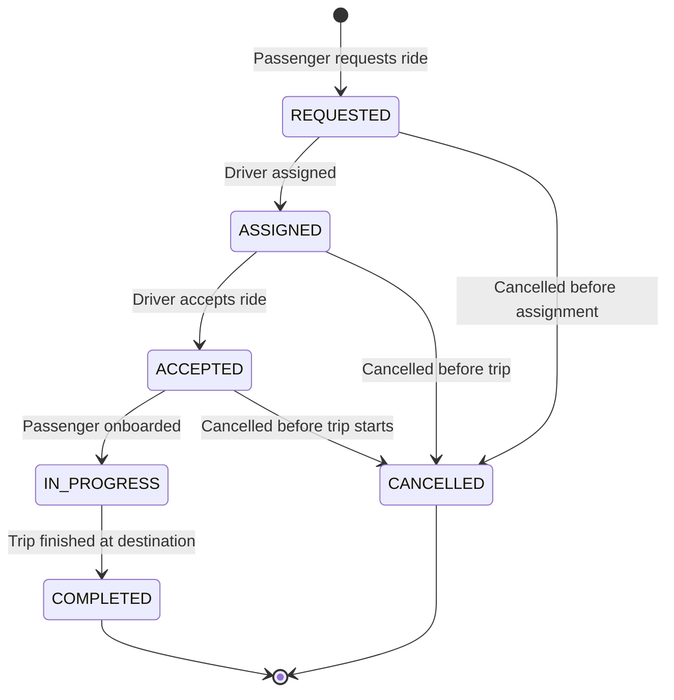

# RideLink - Ride Management Service

[](https://openjdk.org/projects/jdk/17/)
[](https://spring.io/projects/spring-boot)
[](https://www.mongodb.com/)
[](http://localhost:8083/swagger-ui.html)
[](http://localhost:8083)

> **Course:** IT3130 – Application Development  
> **Component:** Microservice 3 – Ride Management Service  
> **Student Name:** Herath H M S R  
> **Student ID:** IT24103280  
> **Email:** it24103280@my.sliit.lk  
> **Status:** `IMPLEMENTED & TESTED`

---

## 1. Service Overview

The **Ride Management Service** is a core microservice within the RideLink distributed ride-sharing platform. It is solely responsible for:
- Orchestrating ride booking requests from passengers.
- Managing the complete **Ride Lifecycle State Machine** (`REQUESTED` -> `ASSIGNED` -> `ACCEPTED` -> `IN_PROGRESS` -> `COMPLETED` / `CANCELLED`).
- Driver assignment coordination.
- Passenger and Driver ride history queries.
- Persisting ride documents into an isolated MongoDB database (`ride_db`).

In compliance with microservices best practices:
- **Database-per-service isolation:** Only Ride Management Service communicates with `ride_db`.
- **Loose coupling:** Cross-service references use stable scalar IDs (`passengerId`, `driverId`, `fareId`).

---

## 2. Technology Stack

| Component | Technology | Version / Details |
| :--- | :--- | :--- |
| **Language** | Java | 17 (LTS) |
| **Framework** | Spring Boot | 3.3.4 |
| **Persistence** | Spring Data MongoDB | MongoDB Database: `ride_db`, Collection: `rides` |
| **Validation** | Jakarta Bean Validation | `spring-boot-starter-validation` |
| **Documentation** | Springdoc OpenAPI (Swagger UI) | 2.5.0 (`http://localhost:8083/swagger-ui.html`) |
| **Testing** | JUnit 5 + MockMvc + Postman | Comprehensive Positive & Negative Test Suites |
| **Port** | HTTP Port | `8083` (Default, configurable via `RIDE_SERVICE_PORT`) |

---

## 3. Ride Lifecycle State Machine

The service strictly enforces valid lifecycle transitions using the `RideLifecycle` domain validator:



### Transition Matrix & Rules:
- **`REQUESTED`** $\rightarrow$ `ASSIGNED`, `CANCELLED`
- **`ASSIGNED`** $\rightarrow$ `ACCEPTED`, `CANCELLED`
- **`ACCEPTED`** $\rightarrow$ `IN_PROGRESS`, `CANCELLED`
- **`IN_PROGRESS`** $\rightarrow$ `COMPLETED` *(Trip cannot be cancelled once in progress)*
- **`COMPLETED` & `CANCELLED`** $\rightarrow$ Terminal states (no further transitions allowed)
- Attempting any invalid or skipped transition returns **`409 Conflict`**.

---

## 4. REST API Specification

Base URL: `http://localhost:8083/api/v1/rides`

| Method | Endpoint | Description | Status Codes |
| :---: | :--- | :--- | :---: |
| `GET` | `/` | Service health check and metadata | `200 OK` |
| `POST` | `/api/v1/rides` | Create a new ride request | `201 Created`, `400 Bad Request` |
| `GET` | `/api/v1/rides` | Get all rides (optionally `?status=...`) | `200 OK` |
| `GET` | `/api/v1/rides/{rideId}` | Get ride details by UUID | `200 OK`, `404 Not Found` |
| `PATCH` | `/api/v1/rides/{rideId}/status` | Update status along lifecycle | `200 OK`, `409 Conflict`, `404 Not Found` |
| `PATCH` | `/api/v1/rides/{rideId}/assign-driver/{driverId}` | Assign driver (moves to `ASSIGNED`) | `200 OK`, `404 Not Found` |
| `GET` | `/api/v1/rides/passenger/{passengerId}` | Passenger ride history | `200 OK` |
| `GET` | `/api/v1/rides/driver/{driverId}` | Driver assigned rides | `200 OK` |
| `DELETE` | `/api/v1/rides/{rideId}` | Cancel a ride | `200 OK`, `409 Conflict`, `404 Not Found` |

---

## 5. MongoDB Document Schema (`rides` collection)

```json
{
  "_id": "550e8400-e29b-41d4-a716-446655440000",
  "passengerId": "6abbfa6d095b5451ceb2f209",
  "driverId": "6abbfa6d095b5451ceb2f20a",
  "pickupLatitude": 6.9271,
  "pickupLongitude": 79.8612,
  "pickupAddress": "Colombo Fort Railway Station, Colombo",
  "destinationLatitude": 6.9147,
  "destinationLongitude": 79.8732,
  "destinationAddress": "SLIIT Metropolitan Campus, Colombo 03",
  "status": "COMPLETED",
  "distanceKm": 8.5,
  "durationMinutes": 22,
  "fareId": null,
  "createdAt": "2026-09-29T10:15:30.000Z",
  "updatedAt": "2026-09-29T10:37:30.000Z"
}
```

Indexed fields: `passengerId`, `driverId`, `status`.

---

## 6. How to Run the Service

### Prerequisites
1. **Java 17 (JDK 17)** installed and configured (`java -version`).
2. **Apache Maven 3.8+** installed (`mvn -version`).
3. **MongoDB** instance running locally on `localhost:27017` OR a MongoDB Atlas cluster URI.

### Option A: Local MongoDB
Ensure MongoDB is running locally:
```bash
# If using MongoDB Community Service (Windows Services)
net start MongoDB

# Or if running MongoDB via Docker:
docker run -d --name mongodb -p 27017:27017 mongo:latest
```

### Option B: MongoDB Atlas (Cloud)
Set the environment variable or create `.env` / `application-local.yml`:
```yaml
spring:
  data:
    mongodb:
      uri: mongodb+srv://<username>:<password>@cluster0.mongodb.net/ride_db?retryWrites=true&w=majority
```

### Start the Microservice:
From the `ride-management-service` directory:
```bash
# Compile and package
mvn clean package -DskipTests

# Run the Spring Boot application
mvn spring-boot:run
```

Or from root:
```bash
mvn spring-boot:run -pl ride-management-service
```

Once started, the console will output:
```
Tomcat started on port 8083 (http) with context path '/'
Started RideManagementServiceApplication in ... seconds
```

---

## 7. Interactive Swagger UI & OpenAPI 3 Documentation

When the service is running, open your web browser:

- **Swagger UI Interactive Interface:**  
  👉 **`http://localhost:8083/swagger-ui.html`**  
  *(or `http://localhost:8083/swagger-ui/index.html`)*

- **OpenAPI v3 JSON Specification:**  
  👉 **`http://localhost:8083/v3/api-docs`**

Swagger UI provides pre-populated examples for every endpoint. You can click **"Try it out"** $\rightarrow$ **"Execute"** directly from the browser!

---

## 8. Postman Testing Guide

A dedicated, ready-to-run Postman collection and environment are provided in the repository:

1. **Import Files into Postman:**
   - Collection: `postman/collections/Ride_Management_Service.postman_collection.json`
   - Environment: `postman/environments/RideLink-Local.postman_environment.json`
2. **Select the Environment:**
   - In Postman, switch the active environment to **`RideLink - Local Environment`**.
3. **Run Requests Sequentially or via Collection Runner:**
   - `01 Health Check & Info`
   - `02 Create Ride Request (Initial: REQUESTED)` *(Automatically saves `ride_id` to environment)*
   - `03 Get All Rides`
   - `04 Get Ride by ID`
   - `05 Assign Driver to Ride` *(REQUESTED $\rightarrow$ ASSIGNED)*
   - `06 Update Status to ACCEPTED`
   - `07 Update Status to IN_PROGRESS`
   - `08 Complete Trip` *(IN_PROGRESS $\rightarrow$ COMPLETED)*
   - `09 Get Passenger Ride History`
   - `10 Get Driver Assigned Rides`
   - `11 Create Ride For Cancellation`
   - `12 Cancel Ride (DELETE)`
   - `13 [Negative] Invalid State Transition (409 Conflict)`
   - `14 [Negative] Get Ride Not Found (404 Not Found)`
   - `15 [Negative] Create Ride Validation Failure (400 Bad Request)`

All test cases include automated `pm.test(...)` assertions validating response codes, status transitions, and data integrity!

## External ID compatibility

Passenger/account IDs and driver IDs are opaque strings, matching Account and Driver
Service responses. Preserve them exactly; do not parse them as numbers. Ride IDs and
fare IDs remain UUIDs, and durationMinutes remains numeric. A missing/null driverId
still creates an unassigned REQUESTED ride; blank driverId is rejected.

Older rides with numeric external IDs require a deliberate data migration/mapping
before using string-based history queries. Do not assume numeric test IDs identify
real accounts. Use a fresh isolated test database for integration, or back up and
migrate verified mappings with the service owner. No existing database is modified
by this source change. This fixes ID compatibility only: account verification,
Driver HTTP calls and atomic reservation remain separate integration work.

### 2026-09-29 - External identifier compatibility fix

- Changed passengerId and driverId to String throughout the API DTOs, document,
  controller, service and repository. Updated OpenAPI and Postman samples; added
  required nonblank passenger and optional nonblank driver validation.
- Verification: `mvn -B -pl ride-management-service -am verify` with
  `RIDELINK_MONGO_TESTS=true` passed 15 tests, zero failures/errors/skips. Eight new
  HTTP tests cover create/read/assignment/history and validation; one new local
  MongoDB test verifies string storage and repository queries. Its isolated database
  was dropped. No shared/cloud database was used or migrated.
- Remaining: merge this isolated fix into the Ride owner's branch, align existing
  numeric data deliberately, and implement account/driver clients and reservation.
- Git at writing: prepared locally on fix/ride-external-string-ids, based on 9b34d37.
